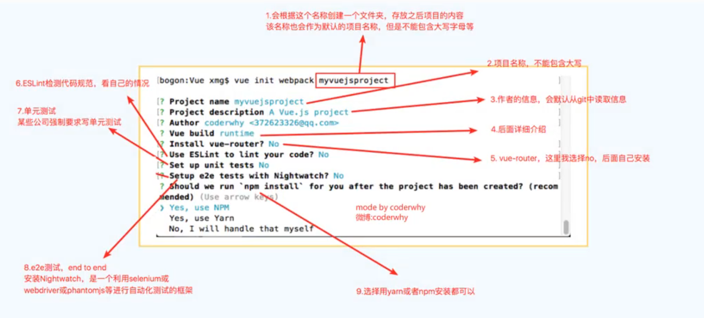

## 一、Vue Cli的使用

- 安装Vue脚手架
  - 安装脚手架：`npm install -g @vue/cli`
  - 查看脚手架版本：`vue --version`

- 安装CLI 2模板
  - `npm install @vue/cli-init -g`

- Vue CLI 2初始化项目
  - `vue init webpack my-project`
- Vue CLI 3初始化项目
  - `vue create my-project`

##  二、Vue CLI 2

### 2.1 初始化项目过程

### 2.2 目录结构

## 三、Vue CLI 3

