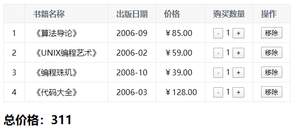

## 一、插值操作

### 1.1、v-once

 - 该指令后面不需要跟任何表达式
 - 该指令表示元素和组件只会渲染一次，不会随着数据的改变而改变

```html
<h2 v-once>{{msg}}</h2>
```

### 1.2、v-html

- 如果得到的数据本身就是一串HTML代码，用{{}}输出会将HTML标签一起输出，这时希望按照HTML格式解析
- v-html用于按照HTML格式进行解析，并且显示对应的内容
  - 该指令后面往往跟上一个string类型，会将string的html解析出来并且进行渲染
```html
<h2 v-html="link"></h2>

data: {link: '<a href="http://www.baidu.com">百度一下</a>'}
```

### 1.3、v-text

- 作用和mustcahe语法作用相同

### 1.4、v-pre

- 将{{}}原封不动的展现出来

### 1.5、v-cloak（斗篷）

- 保持和元素实例的关联，直到结束编译后自动消失，和CSS 一起用的时候，能够解决差值表达式闪烁的问题

- 即：可以隐藏未编译的标签直到实例准备完毕

  

## 二、动态绑定属性

### 2.0、v-bind

​	**用于绑定一个或多个属性值，或者向另一个组件传递props值**

### 2.1、基本使用

```html
          --- 语法糖 --->      
<a v-bind:href="hrefUrl"></a>      --- 语法糖 --->      <a :href="hrefUrl"></a> 
```

### 2.2、动态绑定class（对象语法）

- 绑定方式：对象语法

  - 对象语法的含义是 :class后面跟的是一个对象

- 对象语法有下面这些用法：

```html
<!-- 用法一：直接通过{}绑定一个类 -->
<h2 v-bind:class="{active:isActive}">{{message}}</h2>
<!-- 用法二：通过判断，传入多个值 -->
<h2 v-bind:class="{active:isActive,line:isLine}">{{message}}</h2>
<!-- 用法一：和普通的类同时存在，并不会冲突 -->
<!-- 注：如果isActive和isLine都为true,那么h2标签会有title active line三个class样式属性-->
<h2 class="title" :class="{active:isActive,line:isLine}">{{message}}</h2>
<!-- 用法一：如果过于复杂，可以放在methods或computed中 -->
<!-- 注：class是一个计算属性-->
<h2 class="title" :class="class">{{message}}</h2>
```
具体实例如下：
```html
<html>
	<head>
		<title>动态绑定class</title>
		<style>
			.active {
				color:red
			}
		</style>
	</head>
	<body>
		<div id="app">
            <!-- 对象语法，里面是一个对象，这样子class属性值就可以动态加载 -->
			<h2 v-bind:class="{active:isActive,line:isLine}">{{message}}</h2>
            <!-- 通过method获取 -->
            <h2 v-bind:class="getClass()">{{message}}</h2>
		</div>
	</body>
	<script src="../js/vue.js"></script>
	<script type="text/javascript">
		const app = new Vue({
			el: '#app',
			data: {
				message: '你好啊',
				isActive: true,
				isLine: false,
			},
            methods: {
                getClass() {
                    return {active:this.isActive,line:this.isLine}
                }
            }
		});
	</script>
</html>
```

### 2.3、动态绑定class（数组语法）

```html
<h2 :class="['active','isActive']">{{message}}</h2>
```

### 2.4、v-bind需求案例小作业

- 一个列表，默认第一个红色，点击相应的li后，该<li>变为红色

```html
<html>
	<head>
		<style>
			.active {
				color:red
			}
		</style>
	</head>
	<body>
		<div id="app">
			<ul>
				<li :class="{active: index == currentIndex}" 
                    v-for="(m,index) in movies" 
                    @click="liClick(index)">{{m}}
                </li>
			</ul>
		</div>
	</body>
	<script src="../js/vue.js"></script>
	<script type="text/javascript">
		const app = new Vue({
			el: '#app',
			data: {
				movies:['111','2222','3333','444444'],
				currentIndex:0
			},
			methods: {
				liClick(index) {
					this.currentIndex = index;
				}
			}
		});
	</script>
</html>

```

### 2.5、动态绑定style

- 绑定方式一：对象语法
 - 对象的key是属性名称，对象的value是具体赋的值，值可以来自于data中的属性

  ```html
  <h2 :style="{color:currentColor, fontSize: fontSize + 'px'}"></h2>
  ```

- 绑定方式二：数组语法
```html
  <h2 :style="[baseStyles, overridingStyles, ...]"></h2>
```


## 三、计算属性

- 每一个计算属性都包含一个getter和setter，一般只用了getter来读取，在需要写setter时，代码如下：

```javascript
const app = new Vue({
    data: {firstName: 'Lebron', lastName: 'James'}
	computed: {
        fullName: {
            get(){
          		return this.firstName + ' ' + this.lastName
            },
            // 计算属性一般是没有set方法的
            set(newValue){
                this.firstName = newValue.firstName
                this.lastName = newValue.lastName
            }
        }，
        // 一般以后这种方式写
        getFullName() {
            return this.firstName + ' ' + this.lastName
        }
    }
})
```

- 计算属性会进行<font color="red">缓存</font>，如果多次调用，计算属性只会<font color="red">调用一次</font>


## 四、事件监听

### 4.1、v-on的基本使用

```html
<button v-on:click="btnClick()">点击我</button>
<button @click="btnClick()">点击我</button>
```

### 4.2、v-on的参数问题

- 情况一：方法不需要参数，那么方法后面的()可以不添加

  - 如果方法中本身有一个参数，会将默认原生事件参数$event传递进去

- 情况二：需要event对象，同时又需要其他参数，可以通过$event传入事件

### 4.3、v-on的修饰符

```html
<!-- 停止冒泡（调用event.stopPropagation()） -->
<button @click.stop="doThis()"></button>
<!-- 阻止默认行为（调用event.preventDefault()） -->
<button @click.prevent="doThis()"></button>
<!-- 阻止默认行为，没有表达式 -->
<form @submit.prevent></form>
<!-- 串联修饰符 -->
<button @click.stop.prevent="doThis()"></button>
<!-- 键修饰符，键别名 -->
<input @keyup.Enter="onEnter()"/>
<!-- 键修饰符，键代码 -->
<input @keyup.13="onEnter()"/>
<!-- 点击回调只会触发一次 -->
<button @click.once="doThis()"></button>
<!-- 监听组件根元素的原生事件，直接使用@click是监听不到的 -->
<cpn @click.native="cpnClick()"></cpn>
```

​	**事件冒泡：在点击按钮时候，按钮的click和div的click都会执行，顺序btnClick->divClick。**

```html
<div id="#app">
    <div @click="divClick()">aaaaaaa
        <button @click.stop="btnClick()">按钮</button>
    </div>
</div>
```

​	**阻止默认行为例子：默认点击按钮会自动提交；有时候需要验证后手动提交。**

```html
<form action="/add">
	<input type="submit" value="提交" @click.prevent="submitClick()"/>
</form>
```


## 五、条件判断

- v-if、v-else-if、v-else

  - 这三个指令与JavaScript条件语句if、else、else if类似。

  - Vue的条件指令可以根据表达式的值在DOM中渲染或销毁元素或组件

- 简单的案例演示：

  ```html
  <div>
      <p v-if="score>=90">优秀</p>
      <p v-else-if="score>80">良好</p>
      <p v-else-if="score>=60">优秀</p>
      <p v-else>不及格</p>
  </div>
  ```

- v-if的原理：

  - v-if后面的条件为false时，对应的元素及其子元素互惠渲染

  - 也就是不会有对应的标签出现在DOM中

- Vue在进行DOM渲染时，出于性能考虑，会尽可能的复用已存在的元素，而不是重新创建新的元素。

  - 如果不希望元素复用，可以通过添加不用的key
  
- v-show：渲染后并且设置style="display: none"

- <font color="red">当显示/隐藏切换频率很高的时候用v-show，只有一次切换的时候用 v-if</font>


## 六、循环遍历

### 6.1、v-for遍历数组

```html
<ul>
    <!-- 1. 在遍历过程中不需要下标值 -->
    <li v-for="item in list">{{item}}</li>
    <!-- index是从0开始的 -->
    <li v-for="(item,index) in list">{{item}}</li>
</ul>
```

### 6.2、v-for遍历对象

```html
<ul>
    <!-- 1.在遍历对象过程中，如果只是获取一个值，那么获取到的是value -->
    <li v-for="property in user">{{property}}</li>
    
    <!-- 2.获取key和value,格式(value,key)-->
    <li v-for="(value,key) in user">{{key}}: {{value}}</li>
    
    <!-- 2.获取key和value和index,格式(value,key,index)-->
    <li v-for="(value,key,index) in user">{{index+1}} --> {{key}}: {{value}}</li>
</ul>
<script>
user:{name:'liuk','age':'23',height:'175'}
</script>
```

### 6.3、key属性

- 官网推荐在使用v-for的时候，给对应的元素添加上一个key属性
- **目的：为了搞笑的更新虚拟DOM**


## 七、书籍购物车案例

**效果图：**


**实现代码：**

```html
<!DOCTYPE html>
<html>
  <head>
    <meta charset="utf-8">
	<title>购物车</title>
	<style type="text/css">
	  table {
        border: 1px solid #e9e9e9;
        border-collapse: collapse;
	    border-spacing: 0;
      }
	  th,td {
        padding: 8px 16px;
        border: 1px solid #e9e9e9;
        text-align: left;
      }
      th {
        background-color: #f7f7f7;
        color: #5c6b77;
        font-weight: 600;
      }
    </style>
  </head>
  <body>
	<div id="app">
	  <div v-if="books.length>=1">
		<table>
		  <thread>
			<tr>
			  <th></th>
			  <th>书籍名称</th>
			  <th>出版日期</th>
			  <th>价格</th>
			  <th>购买数量</th>
			  <th>操作</th>
			</tr>
		  </thread>
		  <tbody>
            <tr v-for="(item,index) in books">
              <td>{{index+1}}</td>
			  <td>{{item.name}}</td>
			  <td>{{item.publishDate}}</td>
			  <td>{{item.price | formatPrice}}</td>
			  <td>
			    <button :disabled="item.count<=1" @click="sub(index)">-</button>
				 {{item.count}} 
                <button @click="add(index)">+</button>
			  </td>
			  <td><button @click="remove(index)">移除</button></td>
			</tr>
		  </tbody>
        </table>
		<h2>总价格：{{totalPrice}}</h2>
	</div>
	<div v-else><h2>购物车为空</h2></div>
  </div>
  </body>
<script src="../js/vue.js"></script>
<script type="text/javascript">
  const app = new Vue({
    el: '#app',
	data: {
	  books: [
	    {name:'《算法导论》', publishDate: '2006-09', price: 85, count:1},
	    {name:'《UNIX编程艺术》', publishDate: '2006-02', price: 59, count:1},
	    {name:'《编程珠玑》', publishDate: '2008-10', price: 39, count:1},
	    {name:'《代码大全》', publishDate: '2006-03', price: 128, count:1}
	  ]
	},
	methods: {
      add(index){
        this.books[index].count++;
      },
      sub(index){
        this.books[index].count--;
      },
      remove(index){
        this.books.splice(index,1)
      }
    },
    computed:{
      totalPrice(){
        return this.books.reduce(
          (total,current) => total+=current.price*current.count, 0
        );
      }
    },
    // 过滤器
    filters: {
	  formatPrice(price) {
	    return '￥' + price.toFixed(2);
	  }
    }
  });
</script>
</html>

```


## 八、v-model的使用

### 8.1、实现原理

- v-modal其实是一个语法糖，背后本质是两个操作
  - v-bind绑定一个value属性
  - v-on给当前元素绑定input事件
- 也就是说下面的代码：两者是等价的

```html
<input type="text" v-model="name" />
<input type="text" :value="name" @input="name = $event.target.value"/>
```

### 8.2 v-modal: radio

```html
<div id="app">
  <!-- v-modal绑定同一个数据后，name属性可以省略 -->
  <label for="male">
  	<input type="radio" id="male" value="男" v-modal="sex" />
  </label>
  <label for="female">
  	<input type="radio" id="female" value="女" v-modal="sex" />
  </label>
</div>
```

### 8.3 v-modal: checkbox

**（1）单选框**

```html
<div id="app">
  <label for="female">
  	<input type="checkbox" id="agree" v-modal="isAgree" />同意协议
  </label>
  <button :disabled="!isAgree">下一步</button>
</div>
```

**（2）多选框**

```html
<div id="app">
  <input type="checkbox" value="篮球" v-modal="hobbies" />篮球
  <input type="checkbox" value="足球" v-modal="hobbies" />足球
  <input type="checkbox" value="乒乓球" v-modal="hobbies" />乒乓球
  <input type="checkbox" value="羽毛球" v-modal="hobbies" />羽毛球
  <h2>你选择的爱好是：{{hobbies}}</h2>
</div>
```

### 8.4 v-modal: select

**（1）单选下拉框**

```html
<div id="app">
  <select name="" id="" v-modal="fruit">
    <option value="香蕉">香蕉</option>
    <option value="苹果">苹果</option>
    <option value="葡萄">葡萄</option>
  </select>
  <h2>你选择的水果是：{{fruit}}</h2>
</div>
```

**（2）多选下拉框**

```html
<div id="app">
  <select name="" id="" v-modal="fruits" multiple>
    <option value="香蕉">香蕉</option>
    <option value="苹果">苹果</option>
    <option value="葡萄">葡萄</option>
  </select>
  <h2>你选择的水果是：{{fruit}}</h2>
</div>
```

### 8.5 input中的值绑定

```html
<div id="app">
  <label v-for="item in allHobbies" :for="item">
    <input type="checkbox" :id="item" :value="item" v-modal="selectedHobbies" />{{item}}
  </label>
  <h2>你选择的爱好是：{{hobbies}}</h2>
</div>
```

### 8.6 v-modal修饰符

- lazy
  - 默认情况下，v-modal默认是在input事件中同步输入框的数据的
  - lazy可以让数据在失去焦点或者回车时才更新
- number
  - 让输入框中输入的类容自动转为数字类型
- trim
  - 去空格


